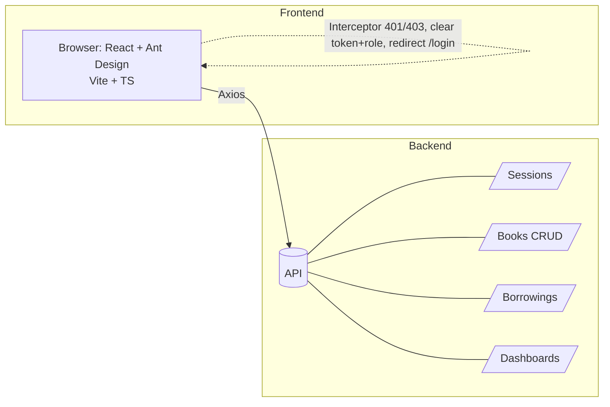
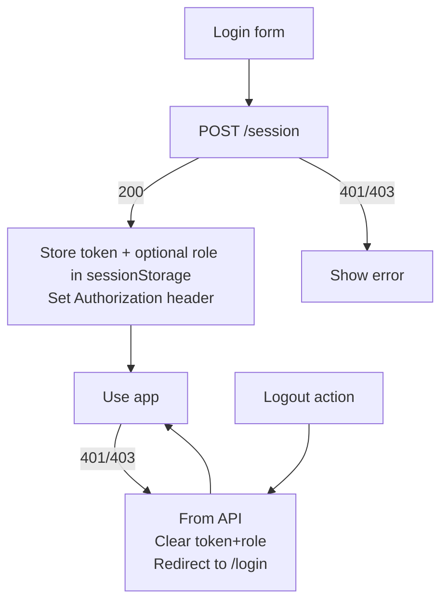
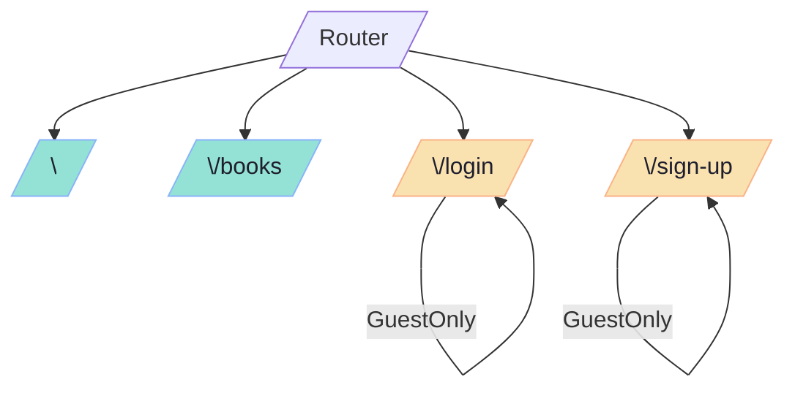
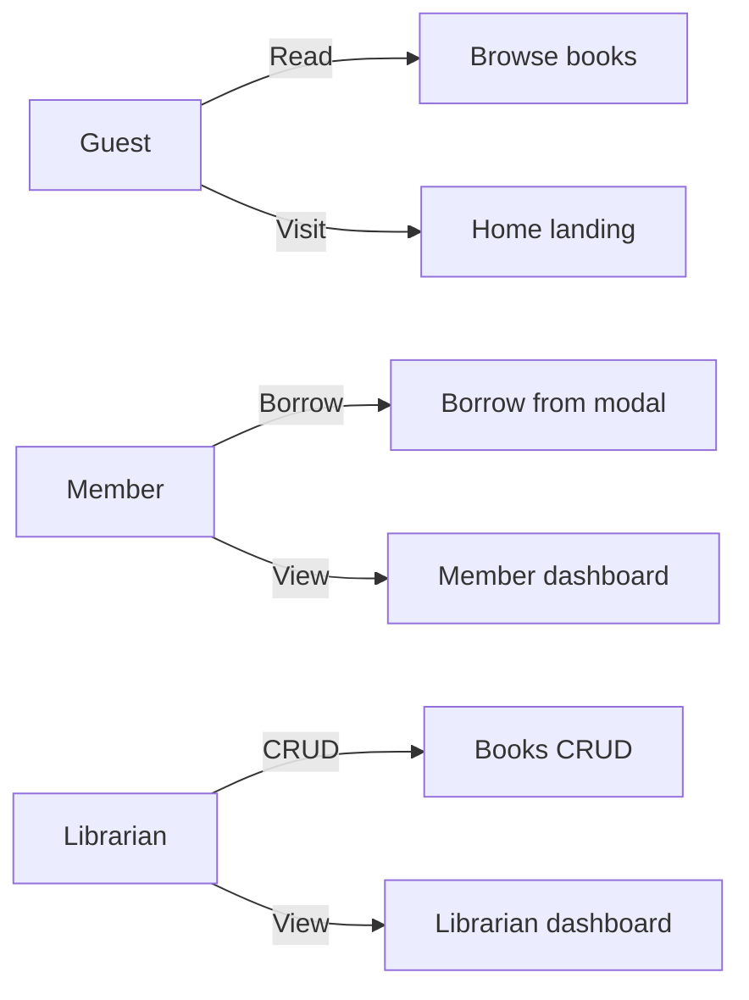
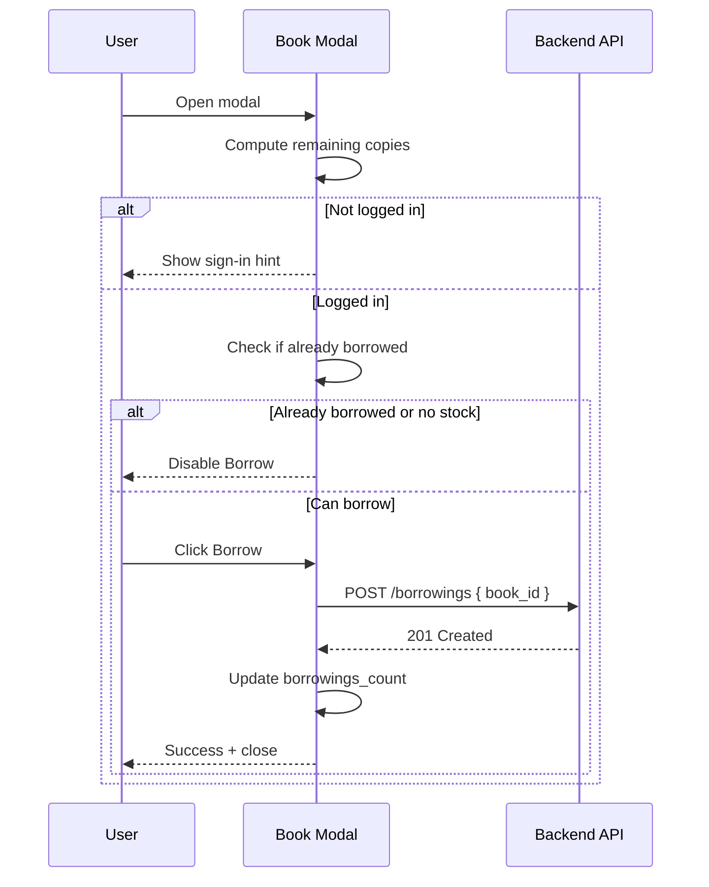

# 📚 Cygnvs Library Frontend

A responsive React + TypeScript app built with Vite and Ant Design for managing a small library. It supports public browsing, member borrowing, and librarian CRUD with a polished Catppuccin-themed UI and subtle animations.

## 🚀 Quick start

Prerequisites:
- Node.js 18+ and npm

Install and run:
- npm install
- Copy .env.example to .env and set VITE_API_URL (defaults to /api for same-origin proxy)
- npm run dev

Build and preview:
- npm run build
- npm run preview

## 🔧 Environment

Create a .env file at project root:
- VITE_API_URL: API base URL (e.g., http://localhost:3000 or /api)

A sample is in .env.example.

## 🧰 Tech stack
- [React 18](https://react.dev/) + [TypeScript](https://www.typescriptlang.org/)
- [Vite](https://vitejs.dev/)
- [Ant Design v5](https://ant.design/) (dark theme customized to [Catppuccin Mocha](https://catppuccin.com/))
- [React Router v7](https://reactrouter.com/)
- [Axios](https://axios-http.com/) with interceptors
- [@tanstack/react-query](https://tanstack.com/query/latest) provider (room for server-driven data)
- [react-spring](https://www.react-spring.dev/) animations via shared Animated components

## 👥 Roles and access
- 👤 Guest:
  - Public Home landing with CTAs and highlights
  - Public Books listing (read-only). “Sign in to borrow” hints shown
- 📖 Member:
  - Can borrow books from the book details modal
  - Member dashboard: stats and tables for Active and Overdue borrowings, with details modal
- 🛡️ Librarian:
  - Full Books CRUD (create, edit, delete) via actions menu and Create button
  - Librarian dashboard: stats and a table of members with overdue books, plus details modal

Auth state uses sessionStorage. Role never exists without a valid token. Interceptors clear token/role on 401/403 and redirect to /login when appropriate.

## 🗺️ App overview
- Home: Shows guest landing when logged out; shows Member or Librarian dashboard when logged in depending on role
- Books 📚:
  - AntD Table with search, sorting on all columns, fixed layout, and mobile horizontal scroll
  - Availability, Remaining Copies, and details modal with Borrow action (gated by login and disabled if already borrowed)
  - Librarian actions via 3-dots dropdown (Edit/Delete) and Create Book button
- Global UX ✨:
  - Empty states unified via ConfigProvider renderEmpty
  - Mobile-friendly header and a themed, animated mobile side menu
  - Row click opens book details; actions dropdown does not trigger row click

## 📜 Scripts
- npm run dev: Start Vite dev server
- npm run build: Build for production
- npm run preview: Preview production build locally

## 📝 Notes
- Ensure your backend exposes the required endpoints (sessions, books CRUD, borrowings, dashboards).
- Update VITE_API_URL to point to your API or configure a dev proxy.

## 📈 Diagrams

### 🏗️ High-level architecture

### 🔐 Auth/session flow

### 🧭 Routing map and guards

### ✅ Roles and permissions

### 🔁 Borrow sequence (member)

